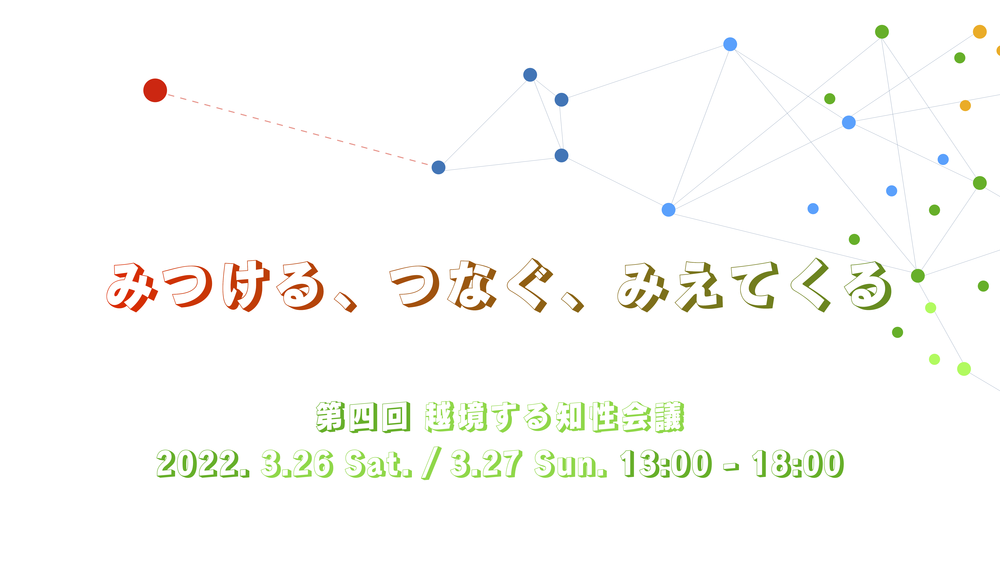

[参加される場合は、こちらから参加登録をお願いいたします。](https://forms.gle/Sdy53h5LUSWp9ftr5)

## プログラム

* Day 1
    * Solo
        * 「マツコの知らないカーネル法の世界」かくびー
        * 「越境する米津玄師論」しおん
        * 「重金属汚染の今までとこれから」ペンギン餅
        * 「ゲーム理論から見た社会」8wings
    * Ensemble

* Day 2
    * Solo
        * 「新入生のための『結局俺は何のプログラミング言語を学べばいいんだ』」メタリックはんぺん
        * 「理論派と実感派　社会に生ける方としての判例」パーカス
        * 「濃度勾配のシミュレーションと初期発生」あきらる
    * Ensemble
    * Orchestration
    * おしゃべりタイム(gather.townで行います！アカウントを作っておいた方がスムーズです)

## 開催日時

3月26日、3月27日　13:00〜18:00

## 開催場所

Zoom (リンクは前日にメールでお知らせします。)

