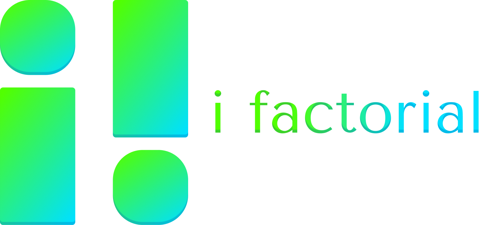

i factorial は「アマチュアのためのアカデミア」をコンセプトに、高校生・大学生を中心とした方々の探究活動を支援する学生団体です。  
越境する知性会議、脱線する知性カフェなどのイベントを中心として、さまざまな活動を行っています。

## 予定されているイベント

- [第4回 越境する知性会議](./ekkyo/event4.md) (3/26, 3/27: zoom 開催)
- 第5回 脱線する知性カフェ (日程未定)

## 活動紹介
- __越境する知性会議__
    - i factorial 最大のイベント。[詳しくはこちら](./ekkyo/ekkyo_about.md)。
- __脱線する知性カフェ__
    - 越境する知性会議の規模を縮小し、Soloを中心とした小さな発表会。[詳しくはこちら](./ekkyo/dassen_about.md)。
- __i factorial journal__
    - i factorialが刊行する学術ジャーナルです。[詳しくはこちら](https://note.com/anabanted/n/n8407c9698f51)
- __i factorial note__
    - i factorial運営メンバーによる活動紹介記事です。[こちら](https://note.com/anabanted/m/maee854bf7adc)から過去の記事を確認できます。
- __i factorial Slack__
    - i factorial のメンバーが集い、情報共有や議論を行っています。
- __i factorial Task Force__
    - 越境する知性会議で生まれた課題について、興味を持った人が研究をしていくチーム活動です。